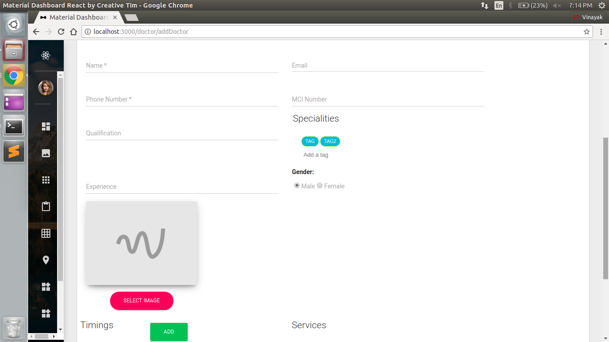
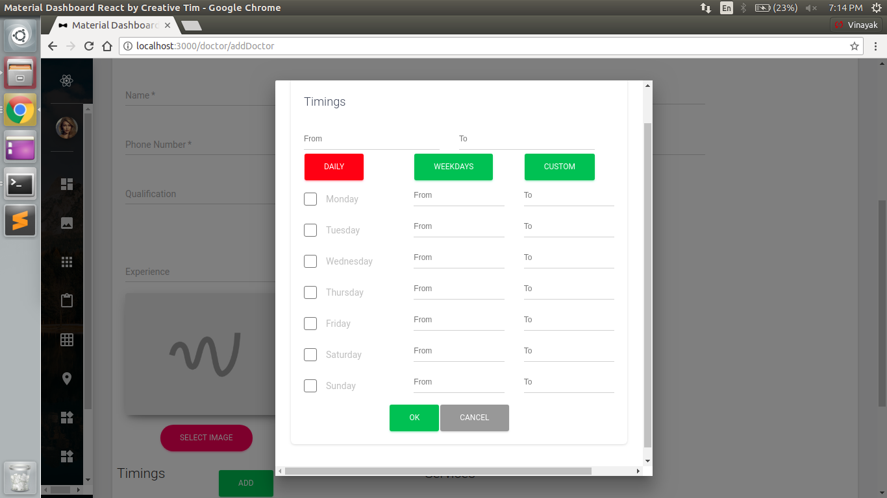

# HealthSpace_frontend

React Front end of Healthspace web app done during MERN stack Internship for startup <b>myHealthspace</b> from June 2018 to July 2018

For front end following technologies were used:
<ul>
  <li><b>ReactJS</b>: Maintain flow of different components and interact with apis</li>
  <li><b>Google Materialise</b>:  Site design and responsiveness </li>
</ul>

Sample pictures of project include:  
      
      
      
      
      
 
